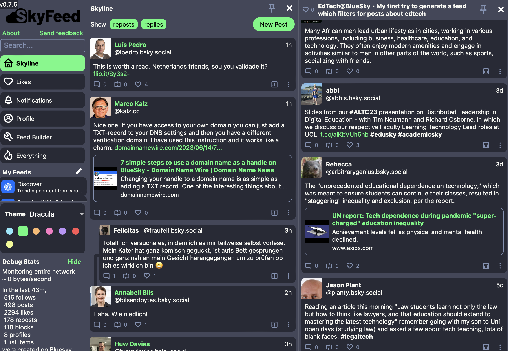
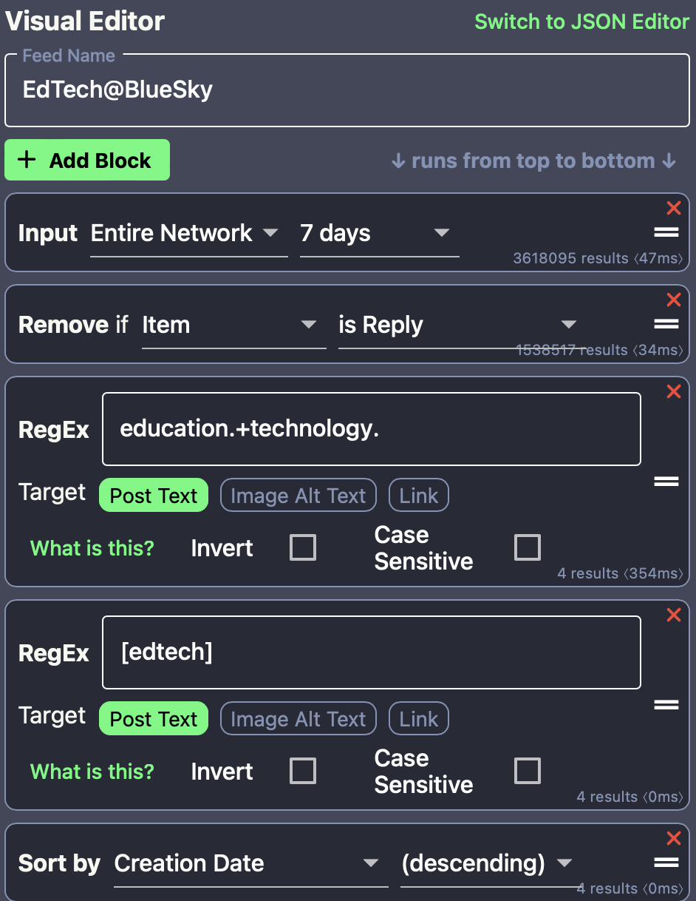

I have started using Twitter on the 24th of November of 2007 and have stopped posting any content exactly 15 years after. From my perception, the network which is called "X" now has been converted into a right-wing propaganda machine and I cannot understand my colleagues who are still active there.  While I shifted some of my writing to LinkedIn, my writing there is longer and less spontaneus (professional pressure probably ;-). Although I did not really miss to post regularly, I have recently explored alternatives approaches like [Nostr](https://nostr.com) and the [Iris app](https://iris.to/marcokalz), but the approach and technology does not seem to be reliable yet. The more I was curious to explore [BlueSky](https://blueskyweb.xyz) which is currently in a public beta for which invite codes are required. Finally, two days ago I have been invited and I had some time to explore BlueSky.

#### Vision of BlueSky and first impression
After we have seen so many problems with social networking sites ("If something is free, then you are the product!"), first and foremost it is essential to have a look at the organisation behind it and its technical vision and business model. BlueSky has been initially started under Twitter Inc. but after the takeover by EM the project went parted ways and the former founder of Twitter Jack Dorsey has established with others the Bluesky PBLLC, a Public Benefit LLC [(see source)](https://blueskyweb.xyz/blog/2-7-2022-overview). There is a background story on the non-profit status [here](https://theintercept.com/2023/06/01/bluesky-owner-twitter-elon-musk/). The potential to be taken over is low from my perspective due to the business model, the formulated vision and the technical basis (an open-source protocol).

After logging in (No, I don´t have an invite code), the setup was very easy and due to the similarity with Twitter, the adoption process to tweet and seach was really fast. A tweet consists of 300 letters and you can add fotos, links and mention others. In addition, you can chose the language in which you are tweeting. So far, so good. After this initial experience, it is important to configure the service according to your needs, which I will explain next.

#### Adapting personal preferences
The first important configuration option is the configuration of your home feed. For some reasons, there is a threshold of likes defined before a reply to one of your feeds is visible. Also reposts and quotes can be activated to become visible. The second important configuration are the language options for the home feed. You can decide which languages you want to see in the feed. The third and most important configuration are available under the menu-items "Moderation". Instead of trusting the owners of the platform regarding moderation like on "X", on BlueSky the user decides which content should be shown. There are for example settings for explicit images, hate and spam and the user can configure what he wants to be shown. I think this is a very good sign and in general, the atmosphere on BlueSky is like in the old days before fake news, truth.social and alike. After this initial setup, one can search for useres of interest. Since it is not yet a public service, there are not yet as many interesting profiles on BlueSky for my domain of interest, but I expect a steady growth. Next I will explain some more advanced features.

#### Using your own domain
Instead of authenticating against the "bsky.social"-handle on the service, user who have access to their own domain name and the connected DNS-server can just add a TXT-entry and then the handle will be replaced by the individual domain. [Here is an article](https://domainnamewire.com/2023/06/14/7-simple-steps-to-use-a-domain-name-as-a-handle-on-bluesky/), which describes the process. BlueSky also supports the buying and configuration of domain names soon.

#### Configuring feeds
The process to configure your own feeds is at the moment still a little bit complicated. I have used the TweetDeck-lookalike "SkyDeck" for this process (see below). Via some combinations of conditions and regular expressions users can create feeds there which are the made public and are available in the app for the public.

#### Summary
Overall, my impression of BlueSky is very positive and I will develop my account there for some time to make some more experiences, I hope that there will be an individual subscription option, because for an ad-free network, in which I can configure what I see and in which order, I would definetly be willing to pay.